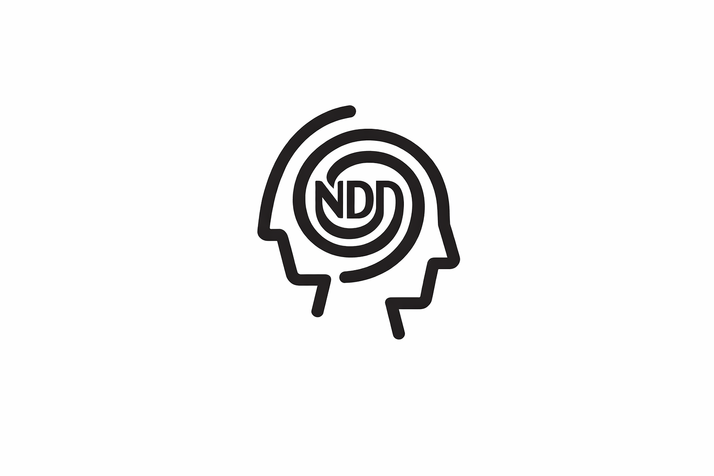

<p align="center">
  
</p>

<h1 align="center">NeuroDevDiff</h1>


 NeuroDevDiff


---------


## When “I Don’t Know Yet” Is the Right Clinical Answer


NeuroDevDiff (NDD) is a synthetic dataset of pediatric neurodevelopmental clinical vignettes,
designed to support research on **AI-assisted decision support under uncertainty**.

The dataset models early-stage clinical referrals commonly encountered in child psychiatry and neurodevelopmental services—situations where information is partial, symptoms overlap across conditions, and cognitive profiles are often heterogeneous rather than neatly classifiable. Each case integrates behavioral features, developmental history, functional impairment, and a structured proxy of cognitive functioning inspired by neuropsychological assessments, alongside an explicit representation of ***what is not yet known?***.

NDD does not aim to automate diagnosis. It starts from the opposite assumption that in many real clinical settings, the most appropriate answer is not a label, but a pause... \
The dataset therefore focuses on questions that clinicians face daily:

- When is available information insufficient?
- What follow-up questions should be asked?
- When should a system defer decisions to a clinician?

NDD is intended for researchers and practitioners interested in responsible AI in healthcare, to play in contexts where **uncertainty, overlap, and missing data are the norm**.


---

## Dataset overview

- **2000 synthetic cases**
- School-age children and adolescents
- Multiple neurodevelopmental and emotional profiles

Explicit modeling of:
  - symptom overlap
  - cognitive heterogeneity
  - missing clinical information
  - decision deferral

The dataset is suitable for:
- tabular ML
- text-based models
- multimodal approaches (text + structured data)
- LLM prompting and fine-tuning

The dataset currently models presentations consistent with:
* ***Autism Spectrum Conditions (ASC / ASD)***
Including heterogeneous cognitive profiles, sensory sensitivities, social communication differences, and rigidity in routines.
* ***Attention-Deficit/Hyperactivity Disorder (ADHD)***
Characterized by attentional difficulties, executive functioning challenges, impulsivity, and variability across contexts.
* ***Anxiety Disorders***
Presentations dominated by worry, avoidance, somatic complaints, school-related anxiety, and internalizing symptoms that may overlap with neurodevelopmental conditions.
* ***Obsessive–Compulsive Disorder (OCD)***
Including intrusive thoughts, repetitive behaviors, and cognitive profiles that may otherwise appear relatively preserved.
* ***Specific Learning Disorders (SLD)***
Profiles with selective academic difficulties (e.g., reading, writing, or math) in the context of otherwise average cognitive functioning.
* ***Selective Mutism***
Marked by context-dependent communication inhibition, often overlapping with anxiety and social withdrawal.
* ***Global Developmental Delay / Intellectual Disability (GDD/ID)***
Presentations with globally reduced and relatively homogeneous cognitive functioning across domains.
* ***Neurodevelopmental Disorder, Unspecified (NDD-UNSPEC)***
Mixed or ambiguous presentations that do not clearly map onto a single category and typically require further assessment.


These profiles are deliberately overlapping and non-exhaustive.
They are meant to reflect how cases are often encountered before a full diagnostic workup, when differential diagnosis and information gathering are still ongoing.

---

## File structure

```
neurodevdiff_v1_full.csv
neurodevdiff_v1_train.csv
neurodevdiff_v1_val.csv
neurodevdiff_v1_test.csv

neurodevdiff_v1_train.jsonl
neurodevdiff_v1_val.jsonl
neurodevdiff_v1_test.jsonl
```

- **CSV files** contain structured variables and generated clinical text.
- **JSONL files** provide input/output pairs suitable for LLM training and evaluation.

Splits are fixed and stratified to ensure reproducibility.

---

## Main components

### A.Clinical context and presentation
- age, sex, context (home/school)
- duration and severity
- observed symptoms
- functional impairment
- red flags
- explicitly missing information

### B. Cognitive profile (synthetic)
Proxy scores inspired by developmental and neuropsychological assessments:
- verbal / language
- visuospatial
- working memory
- processing speed
- attention
- motor

Profiles can be homogeneous, heterogeneous, or globally low.

These are **not clinical scores**, but structured signals designed to support
reasoning and differentiation.

### C. Textual vignette
Each case includes:
- `vignette_en`: a natural-language clinical description
- `questions_to_ask_en`: suggested follow-up questions
- `should_defer_rationale_en`: explanation of uncertainty or risk

---

## Example vignette

> *A pediatric neurodevelopmental evaluation is requested based on caregiver and school concerns.
> The patient is a 11-year-old boy attending primary school.
> Reported difficulties have been present for approximately one year.
> Difficulties are of moderate severity and interfere with daily functioning.
> Core features include sensory sensitivity, rigid routines, difficulties with peer interaction,
> and emotional outbursts during transitions.*
>
> *Cognitive screening indicates a heterogeneous profile, with relative strength in visuospatial
> abilities and relative weakness in working memory and processing speed.
> Key information is currently missing (e.g., developmental history and cross-setting symptom
> consistency), which increases diagnostic uncertainty.*

Suggested follow-up questions:
- When did the difficulties first emerge?
- Are symptoms observed consistently across home and school?
- Is a formal language and pragmatic communication assessment available?

---

## Intended tasks

NeuroDevDiff supports tasks such as:

- **Decision deferral**
  - Should the system proceed or defer to a clinician?

- **Uncertainty-aware reasoning**
  - What information is missing?
  - What questions should be asked next?

- **Differential hypothesis generation**
  - Which profiles are plausible, and why?

- **Multimodal learning**
  - Compare structured-only, text-only, and combined models

Predicting the latent profile is **not** the primary goal.

---

## What this dataset is not

- Not a diagnostic tool
- Not a clinical decision system
- Not a substitute for professional judgment

All data are **fully synthetic** and intended for research and educational use only.

---

## Getting started

You can start by:
- training a simple tabular baseline
- prompting an LLM with the vignettes
- evaluating when models appropriately defer decisions
- comparing confidence calibration across approaches

The dataset is intentionally open-ended to encourage exploration.

---

## Citation

If you use this dataset in academic work, please cite :)

Alvari, G. (2026). *NeuroDevDiff: Synthetic Clinical Vignettes for Neurodevelopmental Decision Support*.
GitHub repository.

A BibTeX entry is available via the “Cite this repository” button on GitHub.

---

## Feedback

Issues, suggestions, and extensions are welcome!